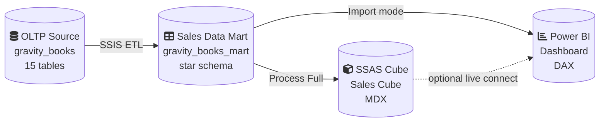
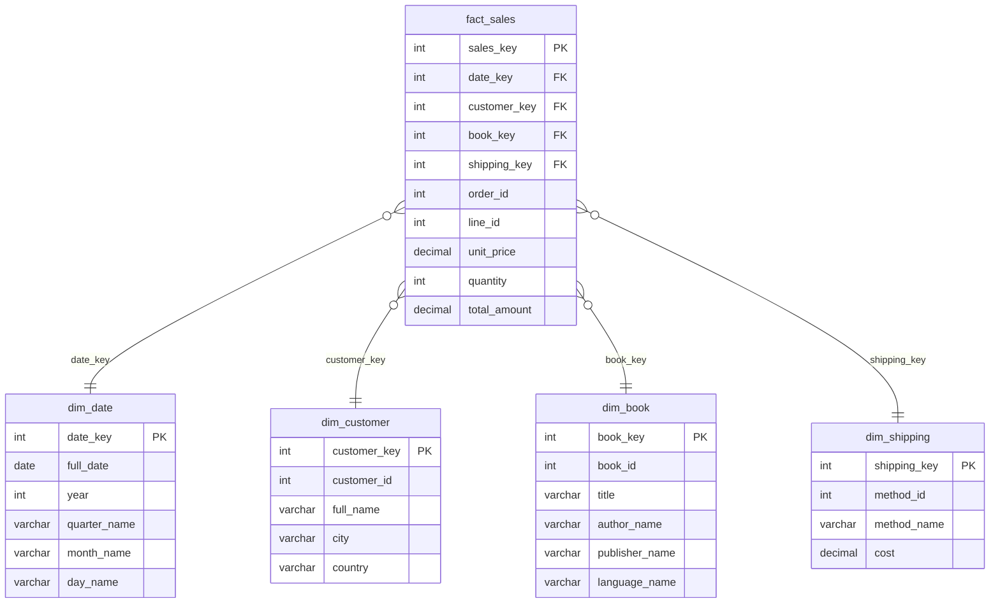

# 📚 Gravity Books — End-to-End BI Pipeline

> From raw transactional data to an interactive dashboard — a complete data warehousing project built with SQL Server, SSIS, SSAS, and Power BI.


---
## Overview

This project takes the **Gravity Books** bookstore dataset through a full Business Intelligence lifecycle. The source system is a normalized OLTP database (15 tables) — great for recording sales, terrible for answering analytical questions like *"what's our best-selling book by country this quarter?"*

The pipeline solves that by building a dimensional **Sales Data Mart**, automating the data movement with an **SSIS ETL package**, pre-aggregating it into an **SSAS OLAP cube**, and surfacing it all in an interactive **Power BI dashboard**.

| Stage | Tool | What happens |
|---|---|---|
| 1. Source | SSMS | Restore and explore the 15-table OLTP database |
| 2. Model | T-SQL | Design a star schema: 1 fact table + 4 dimensions |
| 3. Integrate | SSIS | Automate extraction, key lookups, and loading |
| 3. Aggregate | SSAS | Build an OLAP cube with hierarchies and KPIs |
| 4. Visualize | Power BI | DAX measures, cross-filtering visuals, drill-through |

---

## Architecture



The Data Mart is the hub: SSIS keeps it in sync with the OLTP source, and both SSAS and Power BI read from it independently.

---

## Tech Stack

| Tool | Version | Role |
|---|---|---|
| SQL Server | 2019 / 2022 Developer Edition | Hosts both the OLTP database and the data mart |
| SSMS | 19+ | Schema execution, querying, validation |
| Visual Studio + SSDT | 2019 / 2022 | IDE for SSIS and SSAS projects |
| SSIS | — | ETL automation (extract, lookup, load) |
| SSAS (Multidimensional) | — | OLAP cube with hierarchies and calculated members |
| Power BI Desktop | Latest | Data modeling, DAX, dashboard visuals |

---
## Database Design

### OLTP Source — `gravity_books`

15 tables across three functional groups:

<table>
<tr><th>Book Catalog</th><th>Sales &amp; Orders</th><th>Customer &amp; Logistics</th></tr>
<tr><td valign="top">

`book`
`author`
`book_author`
`book_language`
`publisher`

</td><td valign="top">

`cust_order`
`order_line`
`order_history`
`order_status`

</td><td valign="top">

`customer`
`customer_address`
`address`
`address_status`
`country`
`shipping_method`

</td></tr>
</table>

Key join chain that becomes the fact table:
`customer → cust_order → order_line → book`

### Star Schema — `gravity_books_mart`




**Grain:** one row per order line item (one book within one order).

**Design decisions:**
- **Surrogate keys** (`IDENTITY` columns) decouple the mart from OLTP source ID changes.
- **Denormalized `author_name`** in `dim_book` flattens the many-to-many book↔author relationship using `STRING_AGG`, so no extra join is needed at query time.
- **Pre-populated `dim_date`** (2018–2030) avoids gaps in time-series charts for periods with zero sales.
- **SCD Type 2 columns** (`is_current`, `effective_date`) on `dim_customer` support historical tracking if needed later.
---

## ETL Pipeline (SSIS)

Control flow runs four Data Flow Tasks in dependency order:

| Order | Task | Source → Destination |
|---|---|---|
| 1 | Truncate staging | `Execute SQL Task` clears dim_customer, dim_book, dim_shipping, fact_sales |
| 2 | Load dim_shipping | `shipping_method` → `dim_shipping` (4 rows) |
| 3 | Load dim_book | `book` ⋈ `author` ⋈ `publisher` ⋈ `book_language` → `dim_book` (11,127 rows) |
| 4 | Load dim_customer | `customer` ⋈ `customer_address` ⋈ `address` ⋈ `country` → `dim_customer` (2,000 rows) |
| 5 | Load fact_sales | `cust_order` ⋈ `order_line` + 3 **Lookup** transforms + **Derived Column** → `fact_sales` |

The `fact_sales` flow uses Lookup transformations to resolve OLTP IDs (`customer_id`, `book_id`, `shipping_method_id`) into mart surrogate keys, and a Derived Column to convert `order_date` into an integer `date_key`:

```
(DT_I4)(REPLACE((DT_WSTR,10)(DT_DBDATE)order_date,"-",""))
```

---

## OLAP Cube (SSAS)

**Measures** (all in `fact_sales`):

| Measure | Aggregation |
|---|---|
| Unit Price, Quantity, Total Revenue | Sum |
| Order Count | Distinct Count |
| Avg Order Value | Calculated: `[Total Revenue] / [Order Count]` |
| Revenue YTD | Calculated: `PeriodsToDate` MDX |

**Hierarchies:**

| Dimension | Hierarchy | Levels |
|---|---|---|
| dim_date | Calendar | Year → Quarter Name → Month Name → Day Name |
| dim_book | Book Catalog | Language → Publisher → Title |
| dim_customer | Geography | Country → City → Full Name |

---

## Power BI Dashboard

**DAX measures:**

```dax
Total Revenue    = SUM(fact_sales[total_amount])
Total Orders     = DISTINCTCOUNT(fact_sales[order_id])
Books Sold       = SUM(fact_sales[quantity])
Avg Order Value  = DIVIDE([Total Revenue], [Total Orders])
Revenue YTD      = TOTALYTD([Total Revenue], dim_date[full_date])

Revenue MoM % =
VAR Current  = [Total Revenue]
VAR Previous = CALCULATE([Total Revenue], DATEADD(dim_date[full_date], -1, MONTH))
RETURN DIVIDE(Current - Previous, Previous)
```

**Visuals:** 4 KPI cards, monthly revenue line chart, top-10-books bar chart, shipping-method donut, revenue-by-language treemap, 4 cross-filtering slicers (year, quarter, country, language), and a drill-through "Book Detail" page.

<p align="center">

  <br><em>Add your dashboard screenshot at this path, or update/remove this line.</em>
</p>

---

